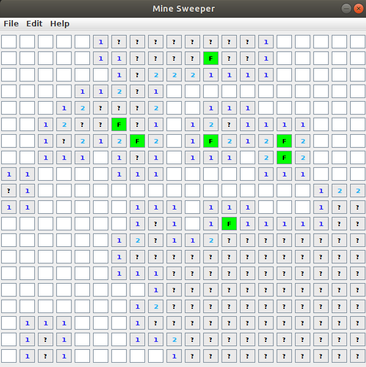

<!-- PROJECT SHIELDS -->
<!--
*** I'm using markdown "reference style" links for readability.
*** Reference links are enclosed in brackets [ ] instead of parentheses ( ).
*** See the bottom of this document for the declaration of the reference variables
*** for contributors-url, forks-url, etc. This is an optional, concise syntax you may use.
*** https://www.markdownguide.org/basic-syntax/#reference-style-links
-->

[![Forks][forks-shield]][forks-url]
[![Stargazers][stars-shield]][stars-url]
[![Issues][issues-shield]][issues-url]

<!-- PROJECT LOGO -->
 

 

<h3 align="center">Mine Sweeper</h3>

  
Game screen

  

   
   

  

    A simple mine sweeper game
     
     
    <a href="https://github.com/MarcoBackman/Mine-Sweeper/#demo-videos">View Demo</a>
    ·
    <a href="https://github.com/MarcoBackman/Mine-Sweeper/issues">Report Bug</a>
    ·
    <a href="https://github.com/MarcoBackman/Mine-Sweeper/issues">Request Feature</a>
  

 
 

<!-- ABOUT THE PROJECT -->
## About The Project

A simple snake game app in java

There are currently 6 features implemented.

1. Use left mouse button to sweep the cell
2. Use right mouse button to setup the flag
3. If every flagged area is a mine cell then, user wins
4. Pressing F5 will reset the game

## Demo image and video

  
Video

  

   
   

(<a href="#top">back to top</a>)

 

### Built With

* [Java JRE 15.0.1](https://www.java.com/en/)

 
 

<!-- GETTING STARTED -->
## How to run?

Java jre must be installed first, please download newest java from [here](https://www.java.com/en/)
In oder to execute the program, please download the file by forking this repository. Or you can download a zipfile from above tab.

 

### Prerequisites

Not publically released

<!-- USAGE EXAMPLES -->
## Usage

Entertainment

<!-- CONTACT -->
## Contact

Marco Backman - roni2006@hanmail.net

(<a href="#top">back to top</a>)

<!-- MARKDOWN LINKS & IMAGES -->
<!-- https://www.markdownguide.org/basic-syntax/#reference-style-links -->
[forks-shield]: https://img.shields.io/github/forks/MarcoBackman/Mine-Sweeper.svg?style=for-the-badge
[forks-url]: https://github.com/MarcoBackman/Mine-Sweeper/network/members
[stars-shield]: https://img.shields.io/github/stars/MarcoBackman/Mine-Sweeper.svg?style=for-the-badge
[stars-url]: https://github.com/MarcoBackman/Mine-Sweeper/stargazers
[issues-shield]: https://img.shields.io/github/issues/MarcoBackman/Mine-Sweeper.svg?style=for-the-badge
[issues-url]: https://github.com/MarcoBackman/Mine-Sweeper/issues
